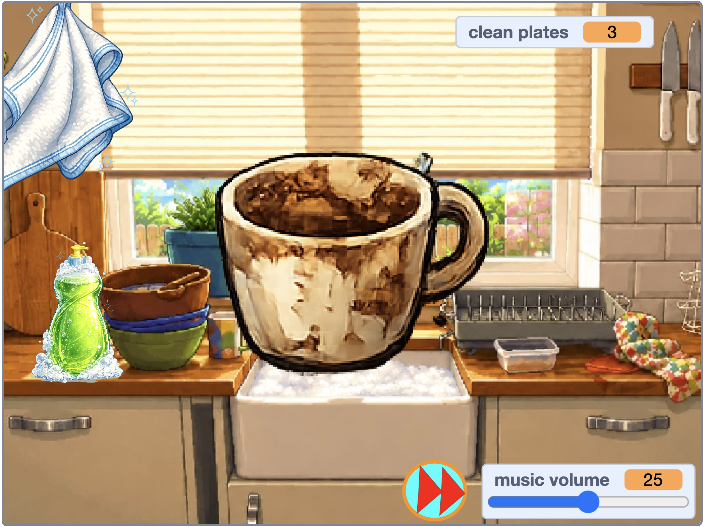

## What you will make

Build a **cosy dishwasher simulator** where the player adds soap, scrubs dirty dishes until they sparkle, and puts them in the rack to score points.

Click the green flag, then click the soap. Click and hold a dirty dish to scrub it clean, then drag it into the rack. Use the volume slider to adjust the music and the skip button to change songs.

--- no-print ---

 <iframe allowtransparency="true" width="485" height="402" src="https://scratch.mit.edu/projects/embed/1362381726/?autostart=false" frameborder="0"></iframe>

--- /no-print ---

--- print-only ---

--- /print-only ---

## Tip

A **cosy game** is designed to feel calm, welcoming, and satisfying rather than stressful or competitive.
