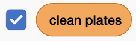

## Create the game variables

The starter project is open beside these instructions, with the sprites, costumes, and sounds ready to use. Create the variables and list that will keep track of the game.

<h2 class="c-project-heading--explainer">What you need to do</h2>

## Step 1

Select the Stage, then open the `Variables`{:class="block3variables"} blocks menu. Make these variables **for all sprites**:

- `clean plates`{:class="block3variables"} — this stores the player's score. Leave this variable ticked so it appears on the Stage.
- `clean`{:class="block3variables"} — this stores a Boolean value that says whether the current dish is clean. **Untick this variable.**
- `soap`{:class="block3variables"} — this stores a Boolean value that says whether the player has picked up soap. **Untick this variable.**

Make sure the only variable still ticked is `clean plates`{:class="block3variables"}:

## Step 2

Keep the Stage selected. Choose **Make a List** from the `Variables`{:class="block3variables"} blocks menu and make a list called `stuff`{:class="block3variables"} **for all sprites**.

Add `bowl` as the first item in the list. You will add the other dishes later.

Untick the checkbox next to `stuff`{:class="block3variables"} so that the list does not appear on the Stage.

## Check your project

Check that `stuff`{:class="block3variables"} contains just `bowl`. The starter has no scripts yet: `clean plates`{:class="block3variables"} should be visible on the Stage, while `clean`{:class="block3variables"}, `soap`{:class="block3variables"}, and the list are hidden.
