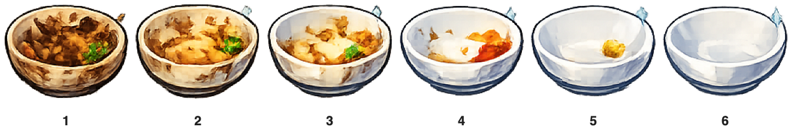

## Start the scrubbing script

Check the bowl costumes and make the sprite respond while it is dirty.

<h2 class="c-project-heading--explainer">What you need to do</h2>

## Step 1

Select the `bowl` sprite in the Sprite pane, then select the **Costumes** tab. Check that its six costumes are named `1` to `6`: costume `1` is filthy and costume `6` is sparkling clean.



## Step 2

Select the **Code** tab for the `bowl` sprite. Start a script that responds when the player clicks the bowl on the Stage, but only while it still needs cleaning.


```blocks3
+when this sprite clicked
+if <(clean) = [false]> then
end
```

## Now run your code

Click the green flag, then click the bowl. It should stay on its dirty costume because the new `if`{:class="block3control"} block has no cleaning instructions yet.
