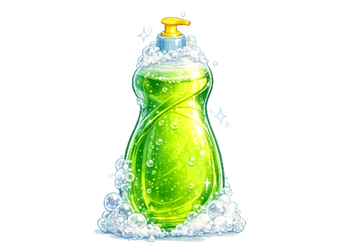

## Finish cleaning the bowl

Mark the dish as clean and explain what happens when the player forgets soap.

<h2 class="c-project-heading--explainer">What you need to do</h2>

## Step 1

After the `repeat until ()`{:class="block3control"} loop, set `clean`{:class="block3variables"} to `true`. This tells the other scripts that scrubbing has finished.


```blocks3
when this sprite clicked
if <(clean) = [false]> then
if <(soap) = [true]> then
repeat until <(costume [number v]) = (6)>
wait until <mouse down?>
start sound (pick random (1) to (4))
next costume
wait (0.2) seconds
end
+set [clean v] to [true]
else
end
end
```

## Step 2

Finally, add feedback to the `else`{:class="block3control"} branch for a player who tries to clean the bowl without soap.


```blocks3
when this sprite clicked
if <(clean) = [false]> then
if <(soap) = [true]> then
repeat until <(costume [number v]) = (6)>
wait until <mouse down?>
start sound (pick random (1) to (4))
next costume
wait (0.2) seconds
end
set [clean v] to [true]
else
+say [You need soap!] for (2) seconds
+start sound (Collect v)
end
end
```

## Tip

Before the player uses soap, the bowl says what it needs. After the player uses soap, the `repeat until`{:class="block3control"} loop moves through the costumes and stops on costume `6`, the sparkling-clean bowl.

## Now run your code

Click the green flag, then click the bowl before using the soap. Next, click the soap and click and hold the bowl to scrub it clean.

 
