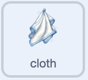
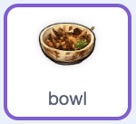

## Make the clean bowl draggable

Tell the player where the clean bowl belongs, then let them drag it.

<h2 class="c-project-heading--explainer">What you need to do</h2>

## Step 1

Select the `cloth1` sprite in the Sprite pane. Add a script that tells the player what to do when the bowl is clean.



```blocks3
+when I receive (clean v)
+say [Now put it in the rack!] for (2) seconds
```

## Step 2

Select the `bowl` sprite in the Sprite pane. Start its clean-dish script: play a sound, remove the soap from the cloth, and make the bowl draggable.



```blocks3
+when I receive (clean v)
+start sound (Coin v)
+set [soap v] to [false]
+set drag mode [draggable v]
```

## Now run your code

Click the green flag, then use the soap and scrub the bowl. The cloth should tell you to put it in the rack, and you should be able to drag the clean bowl.
