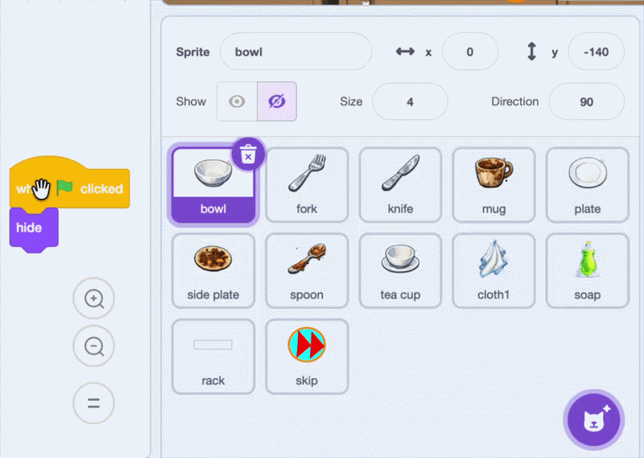

## Copy the dish scripts

Give the other dishes the working bowl code and their own messages.

<h2 class="c-project-heading--explainer">What you need to do</h2>

## Step 1

Drag each of the bowl's four scripts onto every other dish sprite in the Sprite pane:

- `fork`
- `knife`
- `mug`
- `plate`
- `side plate`
- `spoon`
- `tea cup`

## Step 2

Select each copied sprite in the Sprite pane. In the script that makes the dirty dish appear, change `when I receive (bowl)`{:class="block3events"} to a message with the same name as the sprite. Choose **New message** to create each message the first time you need it.

Leave the first `switch costume to ()`{:class="block3looks"} block set to costume number `1`. Costume `1` is the filthy costume on every dish sprite, so this block is identical in every copied script.

## Tip

Game developers often build and test one working **prototype** first. Fixing the bowl before copying its scripts makes problems easier to find.

## Now run your code

Click the green flag and clean a bowl. The bowl should still work, and the other dishes should stay hidden. Your `stuff`{:class="block3variables"} list still contains only `bowl`; you will add the other names next.
