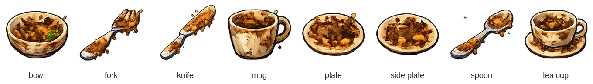
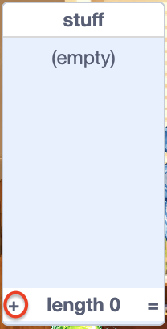
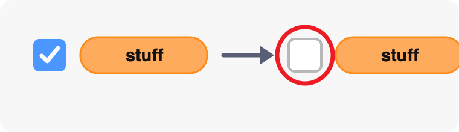

## Choose from all eight dishes

Add the other dish names to the random selection now that their scripts are ready.

<h2 class="c-project-heading--explainer">What you need to do</h2>

Select the Stage and open the `Variables`{:class="block3variables"} blocks menu. Tick the checkbox next to `stuff`{:class="block3variables"} so that you can see the list on the Stage.

Use the plus button on the list to add these seven message names, one item on each line:

2. `fork`
3. `knife`
4. `mug`
5. `plate`
6. `side plate`
7. `spoon`
8. `tea cup`

Untick the checkbox next to `stuff`{:class="block3variables"} again so that the list does not appear on the Stage.

## Tip

The random broadcast uses `length of [stuff]`{:class="block3variables"}, so it can choose from all eight list items without you changing the random-number range.

## Now run your code

Click the green flag and play several rounds. Check that different dirty dishes appear and that every dish starts on costume `1`, can be scrubbed clean, and increases the score when it reaches the rack.

