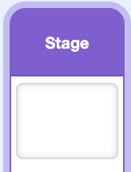

## Play the second song

Add another branch for song two.

<h2 class="c-project-heading--explainer">What you need to do</h2>

## Step 1

Inside the first `else`{:class="block3control"} branch, add another `if () then else`{:class="block3control"} block. Check whether `song`{:class="block3variables"} is `2`. Leave both new branches empty for now.



```blocks3
when I receive (play music v)
forever
if <(song) > (3)> then
set [song v] to (1)
end
if <(song) = (1)> then
play sound (song1 v) until done
else
+if <(song) = (2)> then
else
end
end
end
```

## Step 2

In the `song = 2` branch, add a block that plays `song2` until it finishes.


```blocks3
when I receive (play music v)
forever
if <(song) > (3)> then
set [song v] to (1)
end
if <(song) = (1)> then
play sound (song1 v) until done
else
if <(song) = (2)> then
+play sound (song2 v) until done
else
end
end
end
```

## Now run your code

Temporarily set the starting song to `2` in the Stage setup script. Click the green flag and listen for `song2`, then restore the random-number block.
