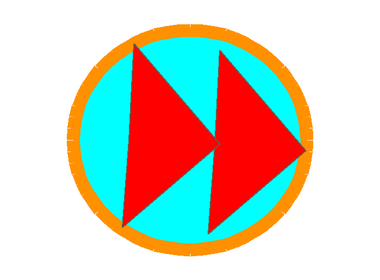

## Skip to the next song

Stop the current track so the playlist moves to the next song.

<h2 class="c-project-heading--explainer">What you need to do</h2>

Select the Stage. Add a script for the `skip` message that stops the current song.


```blocks3
+when I receive (skip v)
+stop all sounds
```

Stopping the sound lets the music loop continue to its `change song by 1`{:class="block3variables"} block. The volume-control script keeps running, and the check at the beginning of the music loop resets any song number greater than `3`.

## Now run your code

Click the green flag and clean some dishes. Drag the volume slider and check that the music gets quieter or louder. Click the skip button on the Stage and check that the song changes.

<p align="center"></p>

Remember to save your project.
