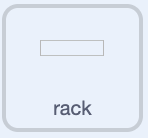
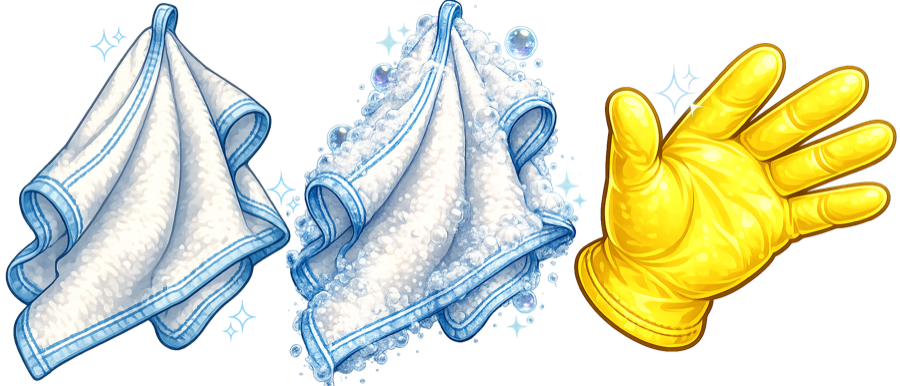

## Set up the rack and cloth

Put the rack in place and make the cloth follow the mouse pointer.

<h2 class="c-project-heading--explainer">What you need to do</h2>

## Step 1

Select the `rack` sprite in the Sprite pane. It will be the target for clean dishes. Use a `when green flag clicked`{:class="block3events"} block to put it in the right place.

The `rack` sprite is just a collision box. It looks plain because the drying rack the player sees is already drawn on the backdrop.



```blocks3
+when green flag clicked
+go to x: (140) y: (-38)
```

## Step 2

Select the `cloth1` sprite in the Sprite pane. Add this script to make the cloth follow the mouse pointer and stay in front of the other sprites.


```blocks3
+when green flag clicked
+forever
+go to (mouse-pointer v)
+go to [front v] layer
end
```

## Tip

In games, two sprites **collide** when they are touching. Later, a `touching ()?`{:class="block3sensing"} block will detect when a clean dish collides with the rack.

## Now run your code

<p align="center"></p>

Click the green flag, then move the mouse pointer around the Stage. The cloth should follow it.
