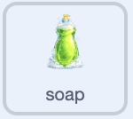

## Make the soap clickable

Let the player pick up soap without dragging its sprite around.

<h2 class="c-project-heading--explainer">What you need to do</h2>

## Step 1

Select the `soap` sprite in the Sprite pane. Add code so the player can use the soap before they scrub a dish.



```blocks3
+when this sprite clicked
+start sound (Bubbles v)
+set [soap v] to [true]
```

## Step 2

Add another script to the `soap` sprite to make it sit behind the dishes.


```blocks3
+when green flag clicked
+set drag mode [not draggable v]
+go to [back v] layer
```

## Now run your code

Click the green flag, then click the soap on the Stage. You should hear the bubbles sound. The soap should stay in place when you try to drag it; the cloth will change costume after you add that code.
