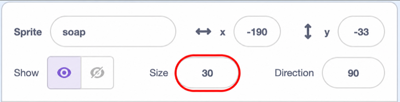

## Make the soap grow

Give the soap a known starting size and begin its animation.

<h2 class="c-project-heading--explainer">What you need to do</h2>

## Step 1

Start one more script on the `soap` sprite. Set its size to `30` percent before adding any blocks that change its size. This known starting size makes it easy to reset the soap if you make a mistake.

Add a `forever`{:class="block3control"} loop beneath the size block.


```blocks3
+when green flag clicked
+set size to (30) %
+forever
end
```

## Step 2

Inside the `forever`{:class="block3control"} loop, add a `repeat ()`{:class="block3control"} loop that gradually makes the soap larger.


```blocks3
when green flag clicked
set size to (30) %
forever
+repeat (15)
+change size by (0.2)
end
end
```

## Tip

`30` percent is the preset starting size for the soap. You can experiment by changing the value in the `set size to () %`{:class="block3looks"} block, and return it to `30` if you want to reset it.



## Now run your code

Click the green flag and watch the soap grow. Click the stop button before it becomes too large. The next step will make it shrink again.
